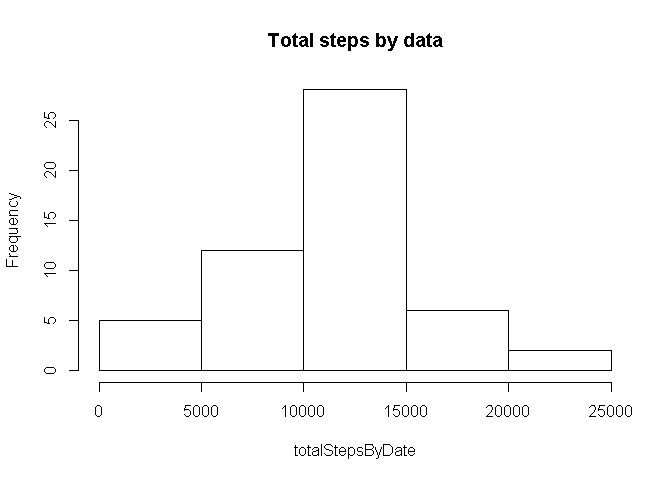
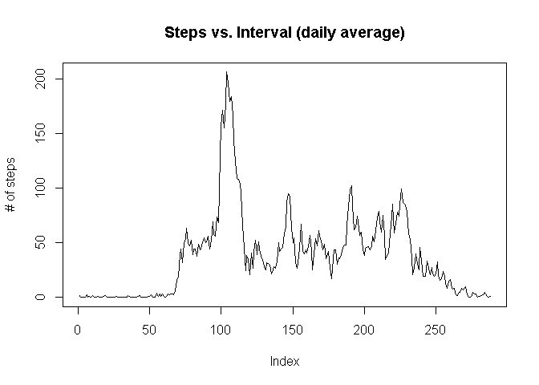
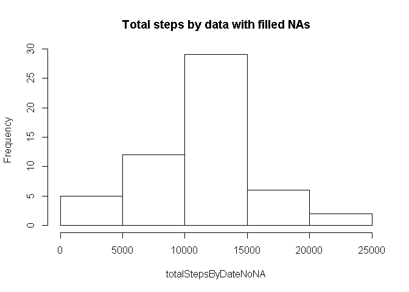
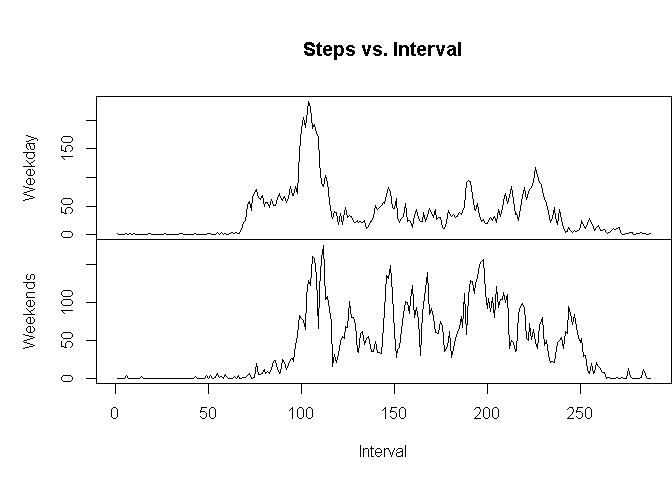

# Reproducible Research: Peer Assessment 1


## Loading and preprocessing the data

```r
dataFileName<-"activity.csv"
dataFile <- file.path(dataFileName)
activityData<-read.csv(dataFile)
```

## What is mean total number of steps taken per day?


```r
totalStepsByDate<-tapply(activityData$steps,activityData$date,sum)
hist(totalStepsByDate,main="Total steps by data")
```

<!-- -->

```r
mean<-round(mean(totalStepsByDate,na.rm=T))
median<-round(median(totalStepsByDate,na.rm=T))
```

the mean of total steps by date is: 10766

the median of total steps by date is: 10765

## What is the average daily activity pattern?

```r
meanByInterval<-tapply(activityData$steps,activityData$interval,mean, na.rm=T)
plot(meanByInterval, type = "l", main = ("Steps vs. Interval (daily average)"), 
    ylab = "# of steps")
```

<!-- -->

## Imputing missing values

```r
numberNAs<- sum(is.na(activityData))
```
the number of NAs in dataset is: 2304


```r
maxInterval<- which.max(meanByInterval)
interval<-names(maxInterval)
```
Max value found in 835 interval


```r
#let's fill NA with mean by that interval value
activityDataNoNA<-activityData
nRows <- is.na(activityData$steps)
activityDataNoNA$steps[nRows]<-round(meanByInterval[nRows])

#let's repeat our calculation now with filled NAs
totalStepsByDateNoNA<-tapply(activityDataNoNA$steps,activityDataNoNA$date,sum)
hist(totalStepsByDateNoNA,main="Total steps by data with filled NAs")
```

<!-- -->

```r
meanNoNA<-round(mean(totalStepsByDateNoNA,na.rm=T))
medianNoNA<-round(median(totalStepsByDateNoNA,na.rm=T))
```
the mean of total steps by date with filled NAs is: 10766

the median of total steps by date with filled NAs is: 10764

the impact of filled NAs is a bit higher value in frequency and a bit drift in meadian value 

## Are there differences in activity patterns between weekdays and weekends?

```r
#let's add a new column saying if current record is in weekend
nRows <- nrow(activityDataNoNA)
activityDataNoNA["day"]<-factor(c("weekend", "weekday"))
isWeekend<-"weekday"
for (i in 1:nRows){
    currentDate <- as.Date(activityDataNoNA$date[i])
    weekDay <-weekdays(currentDate) 
    
    if (weekDay=="sábado" || weekDay=="domingo"){
        isWeekend<-"weekend"
    }else{
       isWeekend<-"weekday" 
    }
    
    activityDataNoNA[i,"day"]<-isWeekend
}


# Calculate the mean
stepsMeanPerWeekday <- tapply(activityDataNoNA$steps, list(activityDataNoNA$interval, activityDataNoNA$day), mean, 
    na.rm = T)

par(mfrow = c(2, 1))
# Display the plots of means steps by weekend or weekday
with(activityDataNoNA, {
    par(mai = c(0, 1, 1, 0))
    plot(stepsMeanPerWeekday[, 1], type = "l", main = ("Steps vs. Interval"), xaxt = "n", ylab = "Weekday")
    par(mai = c(1, 1, 0, 0))
    plot(stepsMeanPerWeekday[, 2], type = "l", xlab = "Interval", ylab = "Weekends")

})
```

<!-- -->

